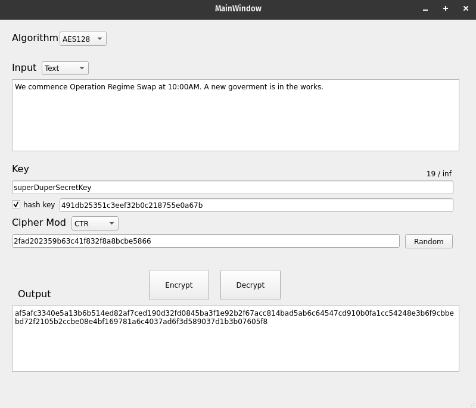

# 🕵🏽‍♂️ WELCOME TO SPYMASTER

### Spymaster is the tool of choice for the sophisticated spy.

> "I used to write my secrets on cocktail napkins. Not anymore. Thanks, Spymaster!"
>
> -- Agent Shaken, Not Stirred

> "Spymaster once encrypted a message so well, HQ thought it was alien contact. 10/10."
>
> -- Zeta Protocol Specialist

> "They say nothing’s uncrackable. Then Spymaster happened. Now we’re back to carrier pigeons."
>
> -- Old School Spy

> "Spymaster: because nobody needs to know you’re out of toilet paper."
>
> -- Anonymous Asset

# 💭 What is Spymaster?

## 

Spymaster is the all-in-one tool for your encryption needs!
Encrypt and decrypt messages with ease!

Currenlty Spymaster has implimented:

- AES
- DES
- CAESER
- PLAYFAIR
- SHA256

And supports cipher modes such as EBC, CBC and CTR.

More cryptographic algorithms and cipher modes coming soon!

> [!NOTE]
> All appropriate cryptographic algorithms are implimented in acordance to FIPS specifications!

> [!CAUTION]
> This project was developed solely for learning purposes. It is not intended for real-world cryptographic applications or securing sensitive data, for that use reliable libraries such as [OpenSSL](https://www.openssl.org/) instead!

# ⚒️ How to build?

To build Spymaster with cmake run the following:

```bash
cmake -S . -B build
cd build && make
# output will be in bin/ of project root
```

> [!WARNING]
> This project was developed on linux, windows support not tested

## Dependencies

The only dependecy is QT for the graphical interface, make sure it's linked properly.

## 🎯 TODO

- ~~Key Hashing via SHA~~
- File I/O
- Visual overhall
- Encryption breaking
